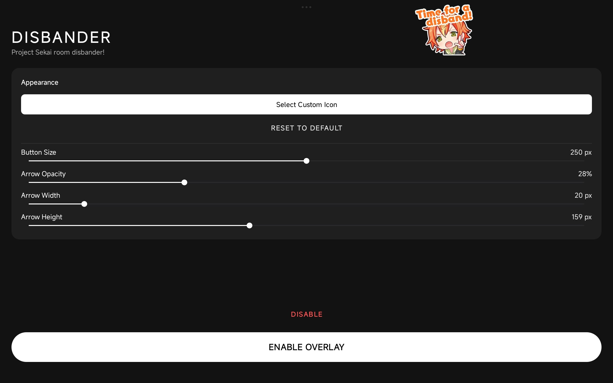
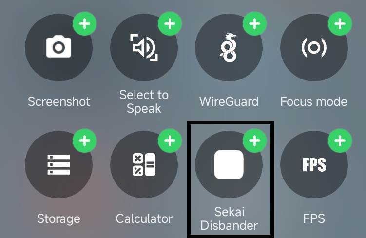

# ⚡ Sekai Disbander

  

**Sekai Disbander** is a powerful utility app designed for *Project Sekai: Colorful Stage!* that allows you to instantly terminate a co-op room connection. It creates a controlled lag spike/network interruption, causing the game to throw a **"Room disbanded (105)"** error for all participants.

Useful for skipping unwanted songs, or dodging unskilled teammates.

---

## 📥 Download

**[Download Latest APK (v1.0)](https://github.com/yummy1gay/disbander/releases/download/v1.0/disbander-v1.0.apk)**

---

## ✨ Features

*   **Instant Disband:** One tap to drop the connection. Works reliably in standard co-op rooms.
*   **Overlay Button:** Floats over the game. Can be collapsed into a small, unobtrusive arrow on the side of the screen.
*   **Smart "Suck" Effect:** The button sticks to the edges of the screen so it doesn't get in the way of gameplay.
*   **Quick Settings Tile:** Toggle the overlay ON/OFF directly from your Android notification shade (Status Bar) without leaving the game.
*   **Customization:**
    *   Adjust button size.
    *   Adjust arrow transparency (opacity).
    *   Change arrow width/height.
    *   **Custom Icon Support:** Upload your own image for the disband button.
*   **No Root Required:** Works on standard Android devices (Android 8.0+).

---

## 📱 Screenshots

<table>
  <tr>
    <th colspan="2">In-Game Overlay (Demo)</th>
  </tr>
  <tr>
    <td colspan="2" align="center">
      <video src="https://github.com/user-attachments/assets/6f1b6e88-6873-4f95-9cdf-d828d08f3f93" width="700" controls autoplay loop muted></video>
    </td>
  </tr>
  <tr>
    <th width="50%">Main Interface</th>
    <th width="50%">Quick Settings Tile</th>
  </tr>
  <tr>
    <td align="center">
      
    </td>
    <td align="center">
      
    </td>
  </tr>
</table>

---

## 🚀 How to Use

1.  **Install & Permissions:**
    *   Download and install the APK.
    *   Grant **"Display over other apps"** permission (essential for the overlay).
    *   Grant **"Notification"** permission (required for the service to run in the background on newer Android versions).
2.  **Setup:**
    *   Open the app.
    *   Customize the button size and arrow style to your liking.
    *   (Optional) Select a funny custom icon.
    *   Tap **"ENABLE OVERLAY"**.
3.  **In-Game:**
    *   The button will appear on your screen.
    *   Drag it to the side to collapse it into a small arrow.
    *   When you want to disband a room, tap the arrow to expand, and **tap the button**.
    *   Boom. Room closed.
4.  **Quick Toggle:**
    *   Open your Notification Shade (Quick Settings).
    *   Edit tiles and drag **"Sekai Disbander"** to your active tiles.
    *   Tap it to toggle the overlay on/off instantly.

---

## 🛠️ Build Instructions

If you want to build this project from source:

1.  **Prerequisites:**
    *   Android Studio (Ladybug or newer recommended).
    *   JDK 17 or higher.
2.  **Clone the repo:**
    ```bash
    git clone https://github.com/yummy1gay/disbander.git
    ```
3.  **Open in Android Studio:**
    *   Wait for Gradle sync to finish.
4.  **Build:**
    *   Go to `Build` -> `Build Bundle(s) / APK(s)` -> `Build APK(s)`.
    *   Or simply press `Shift + F10` to run on a connected device.

---

## ⚠️ Disclaimer

This tool is intended for educational and testing purposes. Using this tool to grief other players or disrupt public matches may violate the game's Terms of Service. The developer assumes no responsibility for banned accounts or angry teammates. **Use responsibly.**